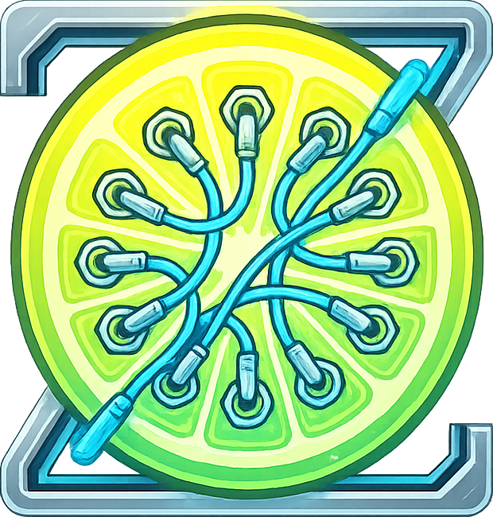

# ZestBay

<p align="center">
  
</p>

<p align="center">
  <strong>A PipeWire patchbay and audio routing manager with integrated LV2 plugin hosting.</strong>
</p>

<p align="center">
  Built with Rust + Qt6/QML for a fast, native Linux desktop experience.
</p>

---

## What is ZestBay?

ZestBay is a visual audio routing tool for PipeWire on Linux. It lets you see every audio node in your system (applications, hardware devices, virtual sinks), connect and disconnect ports with drag-and-drop, host LV2 effects plugins inline, and define patchbay rules that automatically restore your routing whenever devices or apps appear.

## How it differs from other tools

### vs. qpwgraph

qpwgraph is a straightforward PipeWire graph editor. ZestBay goes further:

- **LV2 plugin hosting** -- Insert effects (EQ, compressor, reverb, etc.) directly into the PipeWire graph without needing a DAW or separate plugin host. ZestBay creates real PipeWire filter nodes with RT-safe DSP processing.
- **Native plugin UIs** -- Open the original GTK/X11/Qt plugin interfaces. A persistent GTK thread manages all plugin windows without the crash-on-reopen issues common in LV2 hosts.
- **Auto-connect rules with learning** -- Manually connect two ports and ZestBay automatically creates a patchbay rule. Disconnect them and the rule updates. No manual rule configuration needed (though you can if you want).
- **Full session persistence** -- Plugin instances, their parameters, bypass states, inter-plugin wiring, node layout positions, viewport pan/zoom, window geometry, hidden nodes, and patchbay rules all survive restarts.
- **System tray with start-minimized** -- Run ZestBay as a background service. It starts hidden, keeps your routing rules active, and shows the window when you click the tray icon.

### vs. Carla

Carla is a full-featured plugin host and jack patchbay. The differences are about scope and integration:

- **PipeWire-native** -- ZestBay connects directly to PipeWire's native API, not through the JACK compatibility layer. Every PipeWire node (app streams, hardware devices, virtual sinks) appears naturally in the graph.
- **Lightweight and focused** -- ZestBay is a patchbay first. There is no transport, no MIDI sequencing, no rack view. If you need a full plugin host environment, use Carla. If you need persistent audio routing with inline effects, ZestBay is simpler and faster to set up.
- **Single binary, no runtime dependencies beyond Qt6 and PipeWire** -- No Python, no separate plugin scanner process.
- **Rust** -- Memory-safe core with lock-free DSP-to-UI communication. The RT audio callback uses raw pointers only where PipeWire's filter API requires it.

### vs. Helvum, PatchMatrix, and other GTK patchbays

- **LV2 plugin hosting** -- Most PipeWire patchbays only visualize and connect. ZestBay can host LV2 plugins inline.
- **Auto-connect rules** -- Define patterns that automatically wire things up when nodes appear. Other tools require manual reconnection every time.
- **Qt6/QML** -- Native look and feel on KDE Plasma and other Qt-based desktops.

## Features

### Graph Visualization
- Real-time PipeWire graph with color-coded nodes (sinks, sources, app streams, plugins)
- Smooth pan (middle-click drag) and zoom (scroll wheel, 0.25x-3.0x)
- Drag-to-connect: click a port, drag to another, release to create a link
- Bezier curve link rendering with selection and multi-select (Ctrl+click, selection box)
- Node dragging with group drag for multi-selected nodes
- Hide/unhide nodes, auto-layout, and persistent node positions
- Viewport pan/zoom remembered across restarts

### LV2 Plugin Hosting
- Browse, search, and filter all installed LV2 plugins by name, author, category, or URI
- One-click instantiation as real PipeWire filter nodes with RT-safe audio processing
- 25 recognized plugin categories (Compressor, EQ, Reverb, Delay, etc.)
- In-app parameter sliders with per-parameter reset to default
- Native plugin UI support (GTK3, X11, Qt5, GTK2, GTK4) via suil
- Bypass toggle per plugin
- Rename plugin instances
- Plugin state (parameters, bypass, connections) fully persisted across sessions
- Multiple simultaneous native plugin UIs

### Patchbay Rules
- Auto-learn: connect ports manually and rules are created automatically
- Auto-unlearn: disconnect ports and the rule is updated
- Glob pattern matching for source and target node names
- Per-port-pair mappings with heuristic fallback (channel name, position)
- Snapshot current connections as a complete rule set
- Manual rule editor with quick-fill from existing node names
- Configurable settle time before rules are applied after graph changes
- Global patchbay enable/disable toggle

### System Tray
- Minimize to tray on window close
- Start minimized (background service mode)
- Left-click tray icon to toggle window visibility
- Tray context menu with Show and Quit

### Persistence
Everything is saved to `~/.config/zestbay/` as JSON:

| File | Contents |
|------|----------|
| `preferences.json` | All user settings |
| `plugins.json` | Active LV2 plugin instances with parameters |
| `links.json` | Plugin-to-plugin and plugin-to-node connections |
| `rules.json` | Patchbay auto-connect rules |
| `layout.json` | Node positions in the graph view |
| `hidden.json` | Hidden node list |
| `viewport.json` | Pan and zoom state |
| `window.json` | Window position and size |

## Building from source

### Dependencies

**Runtime:**
- PipeWire
- Qt6 (Base, Declarative, QuickControls2)
- lilv, LV2
- D-Bus

**Build:**
- Rust (stable toolchain)
- Cargo
- Clang
- CMake
- pkg-config
- Qt6 development headers

### Build

```sh
cargo build --release
```

The binary is at `target/release/zestbay`.

### Run

```sh
./target/release/zestbay
```

Or from the project root (for development, so the tray icon theme path resolves):

```sh
cargo run --release
```

## Arch Linux (AUR)

PKGBUILD files are provided in the `pkg/` directory:

- `pkg/zestbay/` -- Release builds from tagged versions
- `pkg/zestbay-git/` -- Development builds from the latest commit

## Architecture

ZestBay uses a multi-threaded architecture with clean separation between components:

- The **Qt/QML thread** runs the UI and polls for events at a configurable interval
- The **PipeWire thread** owns the graph state, processes audio in RT callbacks, and handles all PipeWire API calls
- The **tray thread** runs the D-Bus StatusNotifier service independently
- The **GTK thread** manages native LV2 plugin UI windows
- Communication uses typed channels (`mpsc`) and lock-free atomics -- no mutexes on the audio path

## License

[MIT](LICENSE)
