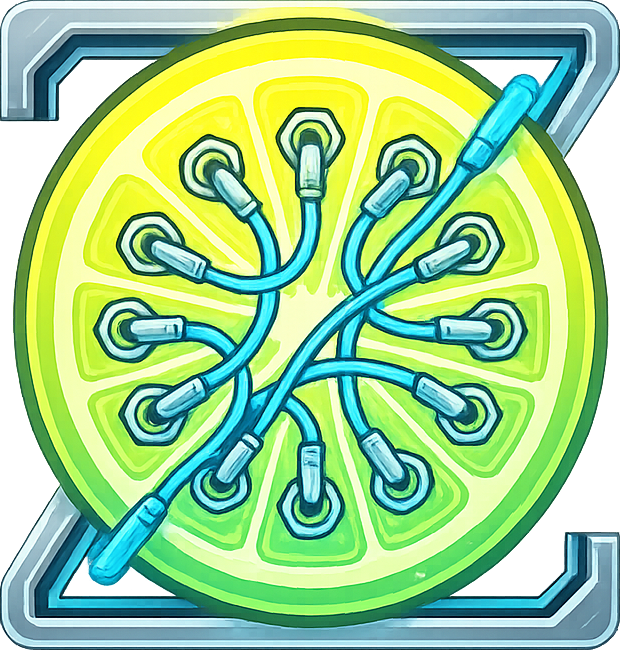

# ZestBay

<p align="center">
  
</p>

<p align="center">
  <strong>A PipeWire patchbay and audio routing manager with integrated LV2, VST3, and CLAP plugin hosting.</strong>
</p>

<p align="center">
  Built with Rust + Qt6/QML for a fast, native Linux desktop experience.
</p>

---

## What is ZestBay?

ZestBay is a visual audio routing tool for PipeWire on Linux. It lets you see every audio node in your system (applications, hardware devices, virtual sinks), connect and disconnect ports with drag-and-drop, host LV2, VST3, and CLAP effects plugins inline, and define patchbay rules that automatically restore your routing whenever devices or apps appear.

## How it differs from other tools

### vs. qpwgraph

qpwgraph is a straightforward PipeWire graph editor. ZestBay goes further:

- **LV2, VST3, and CLAP plugin hosting** -- Insert effects (EQ, compressor, reverb, etc.) directly into the PipeWire graph without needing a DAW or separate plugin host. ZestBay creates real PipeWire filter nodes with RT-safe DSP processing. Comprehensive LV2 extension support (URID, worker, state, log, options, buf-size, data-access, instance-access) means most LV2 plugins load without issues. VST3 and CLAP plugins are hosted with full parameter, state, and native UI support.
- **Native plugin UIs** -- Open the original plugin interfaces. LV2 UIs (GTK3, X11, Qt5, GTK2, GTK4) via suil with full data-access and instance-access support. VST3 and CLAP UIs via embedded X11 windows. A persistent GTK thread manages LV2 plugin windows without the crash-on-reopen issues common in LV2 hosts.
- **MIDI parameter control** -- Map hardware MIDI controllers to any plugin parameter with one-click learn. Continuous, toggle, and momentary modes with RT-safe processing.
- **Auto-connect rules with learning** -- Manually connect two ports and ZestBay automatically creates a patchbay rule. Disconnect them and the rule updates. No manual rule configuration needed (though you can if you want).
- **Full session persistence** -- Plugin instances, their parameters, bypass states, inter-plugin wiring, MIDI mappings, node layout positions, viewport pan/zoom, window geometry, hidden nodes, and patchbay rules all survive restarts.
- **System tray with start-minimized** -- Run ZestBay as a background service. It starts hidden, keeps your routing rules active, and shows the window when you click the tray icon.

### vs. Carla

Carla is a full-featured plugin host and jack patchbay. The differences are about scope and integration:

- **PipeWire-native** -- ZestBay connects directly to PipeWire's native API, not through the JACK compatibility layer. Every PipeWire node (app streams, hardware devices, virtual sinks) appears naturally in the graph.
- **Lightweight and focused** -- ZestBay is a patchbay first. There is no transport, no MIDI sequencing, no rack view. It hosts LV2, VST3, and CLAP plugins for inline effects processing with MIDI CC/note learn for hands-on parameter control from hardware controllers. If you need a full DAW-style plugin host environment with MIDI tracks and transport, use Carla. If you need persistent audio routing with inline effects and hardware knob control, ZestBay is simpler and faster to set up.
- **Single binary, no runtime dependencies beyond Qt6 and PipeWire** -- No Python, no separate plugin scanner process.
- **Rust** -- Memory-safe core with lock-free DSP-to-UI communication. The RT audio callback uses raw pointers only where PipeWire's filter API requires it.

### vs. Helvum, PatchMatrix, and other GTK patchbays

- **LV2, VST3, and CLAP plugin hosting** -- Most PipeWire patchbays only visualize and connect. ZestBay can host plugins from all three major Linux plugin formats inline.
- **Auto-connect rules** -- Define patterns that automatically wire things up when nodes appear. Other tools require manual reconnection every time.
- **Qt6/QML** -- Native look and feel on KDE Plasma and other Qt-based desktops.

## Features

### Graph Visualization
- Real-time PipeWire graph with color-coded nodes (sinks, sources, app streams, plugins)
- Smooth pan (middle-click drag) and zoom (scroll wheel, 0.25x-3.0x)
- Drag-to-connect: click a port, drag to another, release to create a link
- Bezier curve link rendering with selection and multi-select (Ctrl+click, selection box)
- Node dragging with group drag for multi-selected nodes
- Hide/unhide nodes, auto-layout, and persistent node positions
- Viewport pan/zoom remembered across restarts

### Plugin Hosting (LV2, VST3, CLAP)
- Browse, search, and filter all installed plugins by name, author, category, or URI/ID
- One-click instantiation as real PipeWire filter nodes with RT-safe audio processing
- 25 recognized plugin categories (Compressor, EQ, Reverb, Delay, etc.)
- In-app parameter sliders with per-parameter reset to default
- Native plugin UI support:
  - **LV2**: GTK3, X11, Qt5, GTK2, GTK4 via suil
  - **VST3**: Embedded X11 windows with IPlugFrame resize support
  - **CLAP**: Embedded X11 windows with GUI resize and timer support
- Bypass toggle per plugin
- Rename plugin instances
- Plugin state (parameters, bypass, connections) fully persisted across sessions
- LV2 state save/restore integrated into the plugin lifecycle -- state is saved on removal and restored on instantiation
- VST3 component and processor state save/restore
- Multiple simultaneous native plugin UIs

### MIDI Parameter Control
- Map any MIDI CC or note message to any plugin parameter across all plugin formats (LV2, VST3, CLAP)
- **MIDI Learn**: click Learn on a parameter, move a knob or press a key on your controller, done
- Three mapping modes:
  - **Continuous**: CC 0-127 mapped linearly (or logarithmically for log-scale parameters) to the parameter range
  - **Toggle**: each press (CC > 63) flips the parameter between min and max
  - **Momentary**: parameter follows the controller state (on while held, off when released)
- Per-device mappings: bind different parameters to different MIDI controllers simultaneously
- Channel-specific or any-channel matching
- RT-safe processing: MIDI is parsed and applied to parameter atomics directly in the PipeWire audio callback with no locks on the audio path
- Mappings persisted across sessions

### Supported LV2 Extensions
ZestBay provides a comprehensive set of LV2 host features, allowing it to load the vast majority of LV2 plugins:

| Extension | URI | Description |
|-----------|-----|-------------|
| URID Map | `http://lv2plug.in/ns/ext/urid#map` | Map URIs to integer IDs for RT-safe use |
| URID Unmap | `http://lv2plug.in/ns/ext/urid#unmap` | Reverse-map integer IDs back to URI strings |
| Worker | `http://lv2plug.in/ns/ext/worker#schedule` | Non-RT worker thread for heavy operations (file I/O, allocation) |
| State | `http://lv2plug.in/ns/ext/state#makePath` | Plugin state save and restore |
| Log | `http://lv2plug.in/ns/ext/log#log` | Structured logging with LV2 log levels routed to the host log system |
| Options | `http://lv2plug.in/ns/ext/options#options` | Expose host options (block length, sequence size, sample rate) to plugins |
| Buf-Size | `http://lv2plug.in/ns/ext/buf-size#boundedBlockLength` | Advertise bounded and fixed block length capabilities |
| Data Access | `http://lv2plug.in/ns/ext/data-access` | Provide plugin extension data to UIs |
| Instance Access | `http://lv2plug.in/ns/ext/instance-access` | Provide direct plugin instance handle to UIs |
| Resize Port | `http://lv2plug.in/ns/ext/resize-port#resize` | Port buffer resize requests (stub -- returns ERR_NO_SPACE) |
| URI Map | `http://lv2plug.in/ns/ext/uri-map` | Deprecated URI mapping for legacy plugin compatibility |

### Patchbay Rules
- Auto-learn: connect ports manually and rules are created automatically
- Auto-unlearn: disconnect ports and the rule is updated
- Glob pattern matching for source and target node names
- Per-port-pair mappings with heuristic fallback (channel name, position)
- Snapshot current connections as a complete rule set
- Manual rule editor with quick-fill from existing node names
- Configurable settle time before rules are applied after graph changes
- Global patchbay enable/disable toggle

### System Tray
- Minimize to tray on window close
- Start minimized (background service mode)
- Left-click tray icon to toggle window visibility
- Tray context menu with Show and Quit

### Persistence
Everything is saved to `~/.config/zestbay/` as JSON:

| File | Contents |
|------|----------|
| `preferences.json` | All user settings |
| `plugins.json` | Active plugin instances (LV2, VST3, CLAP) with parameters and state |
| `links.json` | Plugin-to-plugin and plugin-to-node connections |
| `rules.json` | Patchbay auto-connect rules |
| `layout.json` | Node positions in the graph view |
| `hidden.json` | Hidden node list |
| `viewport.json` | Pan and zoom state |
| `window.json` | Window position and size |
| `midi_mappings.json` | MIDI CC/note-to-parameter mappings |

## Building from source

### Dependencies

**Runtime:**
- PipeWire
- Qt6 (Base, Declarative, QuickControls2)
- lilv, LV2
- D-Bus

**Build:**
- Rust (stable toolchain)
- Cargo
- Clang
- CMake
- pkg-config
- Qt6 development headers

### Build

```sh
cargo build --release
```

The binary is at `target/release/zestbay`.

### Run

```sh
./target/release/zestbay
```

Or from the project root (for development, so the tray icon theme path resolves):

```sh
cargo run --release
```

## Arch Linux (AUR)

PKGBUILD files are provided in the `pkg/` directory:

- `pkg/zestbay/` -- Release builds from tagged versions
- `pkg/zestbay-git/` -- Development builds from the latest commit

## Architecture

ZestBay uses a multi-threaded architecture with clean separation between components:

- The **Qt/QML thread** runs the UI and polls for events at a configurable interval
- The **PipeWire thread** owns the graph state, processes audio in RT callbacks, and handles all PipeWire API calls
- The **tray thread** runs the D-Bus StatusNotifier service independently
- The **GTK thread** manages native LV2 plugin UI windows
- Communication uses typed channels (`mpsc`) and lock-free atomics -- no mutexes on the audio path

## License

[MIT](LICENSE)
